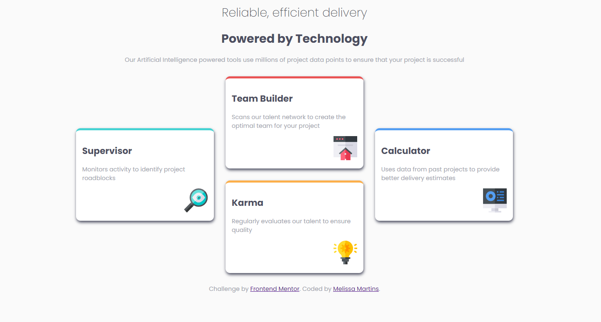

# Frontend Mentor - Four card feature section solution

This is a solution to the [Four card feature section challenge on Frontend Mentor](https://www.frontendmentor.io/challenges/four-card-feature-section-weK1eFYK). Frontend Mentor challenges help you improve your coding skills by building realistic projects. 

## Table of contents

- [Overview](#overview)
  - [The challenge](#the-challenge)
  - [Screenshot](#screenshot)
  - [Links](#links)
- [My process](#my-process)
  - [Built with](#built-with)
  - [What I learned](#what-i-learned)
  - [Continued development](#continued-development)
  - [Useful resources](#useful-resources)
- [Author](#author)


## Overview

### The challenge

Users should be able to:

- View the optimal layout for the site depending on their device's screen size

### Screenshot




### Links

- Solution URL: [Add solution URL here](https://github.com/MellTins/four-card-feature-section-master)
- Live Site URL: [Add live site URL here](https://melltins.github.io/four-card-feature-section-master/)

## My process

### Built with

- Semantic HTML5 markup
- CSS custom properties
- Flexbox
- CSS Grid
- Mobile-first workflow

### What I learned

This was a relatively "easy" challenge, I did have some difficulties positioning the cards in the middle, and then the site kept breaking, but overall I'm happy to have achieved a very similar result.

```css
 #orange {
    grid-row: 2;
    grid-column: 2;
  }
  #green,
  #blue {
    grid-row: span 2;
  }
```
### Continued development

I still have a lot to delve into on the grid, but overall it was a lot of fun to learn the basics of it.

### Useful resources

- [Sujeito Programador](https://www.youtube.com/watch?v=Aql4FvOKcho&ab_channel=Sujeitoprogramador) - This video helped me to practically understand the rows and columns and how I can position them responsively.. I really liked this pattern and will use it going forward.
- [Guide to CSS Grid](https://www.joshwcomeau.com/css/interactive-guide-to-grid/) - This is an amazing article which helped me finally understand Grid. I'd recommend it to anyone still learning this concept.

## Author

- Frontend Mentor - @MellTins
- LinkedIn - (https://www.linkedin.com/in/melissa-martins95/)

